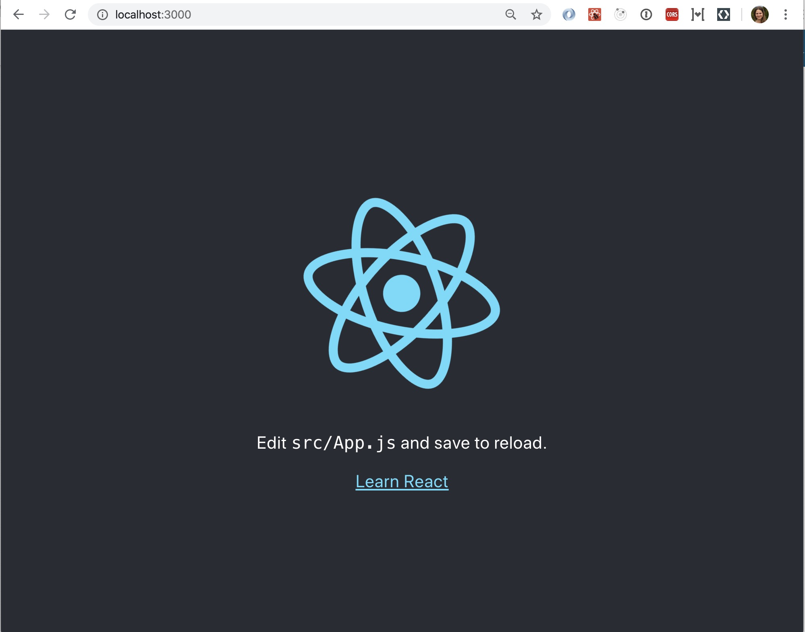
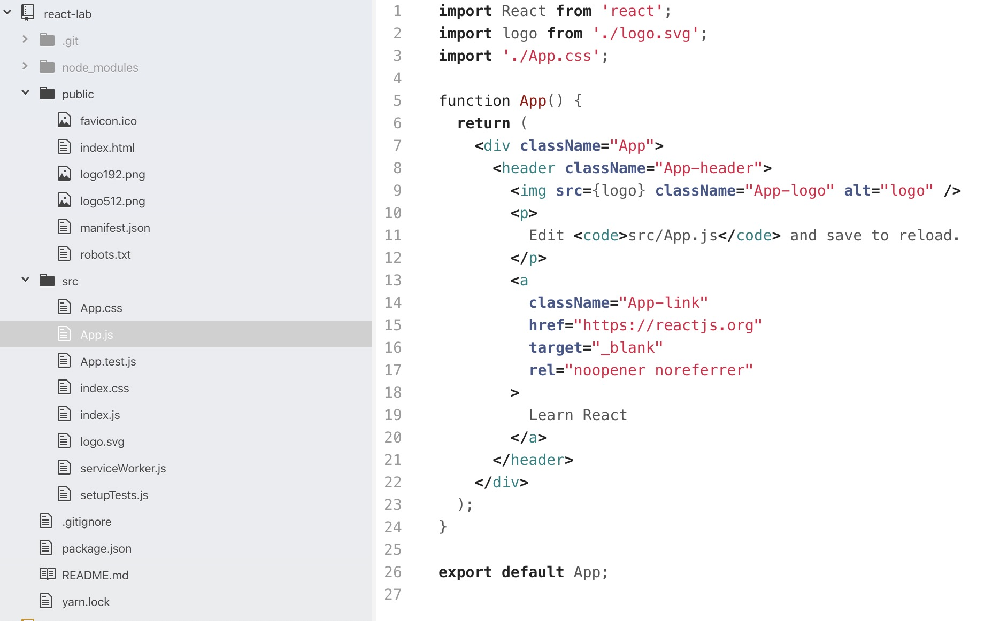
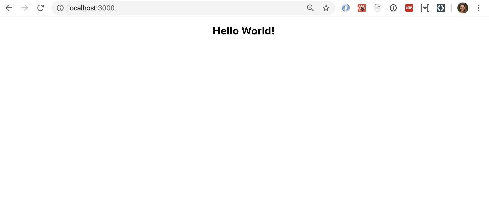

summary: React Codelab
id: docs
categories: React Workshop
tags: react
status: Published
authors: Tatiana

# React Tutorial

## Introduction

### What is React
Duration: 1

- React is a JavaScript library for building use interfaces.
- React is an open-source project created by Facebook.
- React is used to build single page applications.
- React allows us to create reusable UI components.

### How does React work?
Duration: 1

React creates a Virtual DOM in memory.
Instead of manipulating the browser's DOM directly, React creates a virtual DOM in memory, where it does all the necessary manipulating, before making the changes in the browser DOM.
React only changes what needs to be changed.

### ReactJS History
Duration: 1

- Current version of ReactJS is v16.8.6 (March 2019).
- Initial Release to the Public (v0.3.0) was in July 2013.
- ReactJS was first used in 2011 for Facebook's Newsfeed feature.
- Facebook Software Engineer, Jordan Walke, created it.

### Prerequisites
- Basic familiarity with [HTML and CSS](https://internetingishard.com/).
- Basic knowledge of [JavaScript](https://www.digitalocean.com/community/tutorial_series/how-to-code-in-javascript) and programming.
- Basic understanding of the [DOM](https://www.taniarascia.com/introduction-to-the-dom/).
- Familiarity with [ES6 syntax and features](https://www.taniarascia.com/es6-syntax-and-feature-overview/).
- [Node.js and npm](https://www.taniarascia.com/how-to-install-and-use-node-js-and-npm-mac-and-windows/) installed globally.

### What you’ll learn
- JSX - the basic syntax of ReactJS
- ES6 - 6th version of ECMAScript
- React Components - the building blocks of all ReactJS applications
- Components Interacting - how React components interact with each other

### What you’ll build
In this codelab, you are going to build a simple ReactJS app that demonstrates the concepts learned above.

## Setting up the environment
Duration: 2

In our lab we will be using [create-react-app](https://github.com/facebook/create-react-app), a tool that allows you to create an environment with everything you need to build a React app.
If you have NPM and Node.js installed, you can create a React application by first installing the create-react-app.

To install create-react-app run the following command in your terminal:
```javascript
npm install -g create-react-app
```

## Creating and running a React application
Duration: 2

To create a React application named `react-lab` run the following command in your terminal:
```javascript
create-react-app react-lab
```

Once that finishes installing, move to the newly created directory and start the project:
```javascript
cd react-lab
npm start
```

A new browser window will pop up with your newly created React App. If not, open your browser and type `localhost:3000` in the address bar.

The result:


## Modifying the React application
Duration: 5

Go inside the `code-lab` directory, and you will find a `src` folder. Inside the `src` folder there is a file called `App.js`, open it and it will look like this:



Try changing the HTML content and save the file.
> > Notice that the changes are visible immediately after you save the file, you don't have to reload the browser.

```
Example

Replace all the content inside the <div className="App"> with a <h1> element.
See the changes in the browser when you click Save.

import React from 'react';

function App() {
  return (
    <div className="App">
      <h1>Hello World!<h1>
    </div>
  );
}

export default App;
```

The result should be:


React's goal is in many ways to render HTML in a web page.
React renders HTML to the web page by using a function called `ReactDOM.render()`.
The `ReactDOM.render()` function takes two arguments, HTML code and an HTML element.
The purpose of the function is to display the specified HTML code inside the specified HTML element.

```
Example

Display a paragraph inside the "root" element:
ReactDOM.render(<p>Hello</p>, document.getElementById('root'));

The result is displayed in the <div id="root"> element:
<body>
  <div id="root"></div>
</body>
```

## JSX
Duration: 5

You probably noticed, we have been using what looks like HTML in our React code, but it is not quite HTML. This is JSX, which stands for JavaScript XML.

With JSX, we can write what looks like HTML, and also we can create and use our own XML-like tags.

Here's what JSX looks like assigned to a variable:

```
const heading = <h1 className="site-heading">Hello, React</h1>
```

You are not required to use JSX, but JSX makes it easier to write and add HTML in React. Under the hood, it is running createElement()  and/or appendChild() methods.

```
Example with JSX:

const myelement = <h1>I Love JSX!</h1>;
ReactDOM.render(myelement, document.getElementById('root'));
```

```
Example without JSX:

const myelement = React.createElement('h1', {}, 'I do not use JSX!');
ReactDOM.render(myelement, document.getElementById('root'));
```

JavaScript expressions can also be embedded inside JSX using curly braces, including variables, functions, and properties.

```
const name = 'Tatiana'
const heading = <h1>Hello, {name}</h1>
```

JSX is easier to write and understand than creating and appending many elements in vanilla JavaScript, and is one of the reasons people love React so much.

## ES6
Duration: 5

ES6 stands for ECMAScript 6.

ECMAScript was created to standardize Javascript, and ES6 is the 6th version of ECMAScript, it was published in 2015, and is also known as ECMAScript 2015.

React uses ES6, and you provides some features like:
- Classes
- Arrow functions
- Variables (les, const, var)

## React Components
Duration: 3

Almost everything is React consists of components. Components are independent and reusable bits of code. They serve the same purpose as JavaScript functions, but work in isolation and returns HTML via a render function.
Components come in two types, Class components and Function components. Most React apps have many small components, and everything loads into the main `App` component. Components also often get their own file. Currently we have only one component `App`. So, let's change up our project and implement more components.

let's create a table. Make `Table.js` inside `src` folder, and fill it with the following data:

```
import React from 'react'

const Table = () => {
  return (
    <table>
      <thead>
        <tr>
          <th>Name</th>
          <th>Age</th>
        </tr>
      </thead>
      <tbody>
        <tr>
          <td>Charlie</td>
          <td>21</td>
        </tr>
        <tr>
          <td>Celeste</td>
          <td>22</td>
        </tr>
        <tr>
          <td>Morne</td>
          <td>23</td>
        </tr>
        <tr>
          <td>Pavan</td>
          <td>24</td>
        </tr>
      </tbody>
    </table>
  )
}

export default Table
```

Inside the `App.js` file import it in:
`import Table from './Table'`

And change the content of `App.js` file:

```
import React from 'react';

import './App.css';
import Table from './Table'


function App() {
  return (
    <div className="App">
      <Table />
    </div>
  );
}

export default App;
```

## Conclusion
Duration: 3

I hope this lab gave you a good introduction to React. There is much more to learn and do with React, such as:
- Hooks
- Redux
- Saga
- Getting data from API
